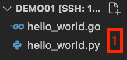
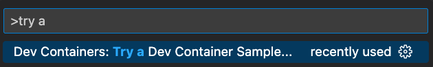

# Intro into VScode Devcontainers for Network Automation <!-- fit -->

<!-- Do not add page number on this slide -->
<!--
_paginate: false
-->


Petr Ankudinov
$~~~~~~~$ EMEA AS
$~~~~~~~$ Last update: Mar 2023

---

# About This Slide Deck

- This slide deck is written in [Marp](https://marp.app/)
- Slides are available as presentation-ready HTML and PDF
- A sample Marp deck explaining the syntax and features is available [here](https://github.com/ankudinov/yet-another-marp-deck)
- The root of this repository contains devcontainer required to build slides. Other examples are located in subdirectories and can be started by executing corresponding Makefile shortcut

<!-- Add footer starting from this slide -->
<!--
footer: '$~~~~~~~~~~~~~~~~~~~~~~~~~~~~~~~~~~~~~~~~~~~~~~~~~~~~~~~~~~~~~~~~~~~~~~~~~~~~~~~~~~~~~~~~~~~~~~~~~~~~~~~~~~~~~~~~~~~~~~~~~~~~~~~~~~~~~~~~~~~~~~~~~~~~~~~~~~~~~~~~~~~~~~~~~~~~~~~~~~~~~~~~~~~~~~$'
-->

---

# Session Targets

<style scoped>section {font-size: 26px;}</style>

- This session is not a deep dive into containers or VSCode
- The purpose is to provide minimum inspiration and motivation for network engineers to try devcontainers. WARNING: addiction guaranteed! 🍰
- Following topics will be covered:
  - devcontainer basics
  - building your own "hand-made" devcontainer
  - add Ansible AVD and Containerlab to you devcontainer
  - do some customization
  - build a container for AVD PR review
  - create a backdoor from your devcontainer for a POC

---

# Why Devcontainers?

<style scoped>section {font-size: 26px;}</style>

- Every project has dependencies.
- Managing dependencies is hard. Possible issues include, but not limited to: conflicting installations, system path, incorrect versions, etc.
- venv/pyenv and similar tools are often very specialized, provide limited isolation and do not cover all possible dependency issues. For ex. venv/pyenv cover Python only and can be easily broken.
- Containers provide a better way to build a stable environment, but learning barrier is higher.
- Devcontainers provide all advantages of containerized environments with additional advantages:
  - easy to build
  - easy to use
  - very portable


---

# Is It Hard to Build a Good Container?

<style scoped>section {font-size: 22px;}</style>

- To build a reasonable container the following steps are usually required:
  - Craft a base Docker file with some essentials
  - Add non-root user, as root can break permissions in certain scenarios
  - The non-root user ID may not match user ID outside of the container. On some operating systems (for ex. RHEL and the family) that can be a serious problem. Find a way to map UID inside the container to the original UID. [Not a trivial task](https://github.com/arista-netdevops-community/avd-quickstart-containerlab/blob/master/.devcontainer/updateUID.Dockerfile)
  - Create an [entrypoint](https://docs.docker.com/engine/reference/builder/#entrypoint). I'm certain everyone has a perfect understanding of this concept. :slightly_smiling_face: Here is a relatively simple [example](https://github.com/arista-netdevops-community/avd-all-in-one-container/blob/master/entrypoint.sh)
  - Take care of transferring your Git credentials, keys, etc. into the container if it was created as interactive
  - Think about security and something else that you'll certainly forget or never have time to start
  - ... and it has to be multi-platform
- Devcontainers are taking care of most of the points mentioned above out of the box 👍 📦

---

# What is VScode Devcontainer?

A picture worth a thousand words. [Source](https://code.visualstudio.com/docs/devcontainers/containers).


---

# Getting Started

<style scoped>section {font-size: 26px;}</style>

- [VSCode](https://code.visualstudio.com/download)
- Some kind of Docker
  - MacOS ➡️ Docker Desktop
  - Windows ➡️ WSL2 ➕ Docker Desktop
  - Linux ➡️ Docker CE/EE
- Check [VSCode documentation](https://code.visualstudio.com/docs/devcontainers/containers) for the details.
- Remote Development plugin for VSCode (ms-vscode-remote.vscode-remote-extensionpack). Contains:
  - Remote SSH
  - Dev Containers
  - WSL

---

# Vagrant VM

<style scoped>section {font-size: 22px;}</style>

- You can run all the demos locally on your machine if VSCode and Docker are working correctly. Nothing else is required, just open the corresponding demo directory
- The Vagrant VM is provided:
  - To provide consistent demo environment without OS specific challenges
  - To simplify interaction with the lab by relying on make shortcuts to open each demo
- The Vagrant VM requires following to work:
  - [Virtualbox](https://www.virtualbox.org/wiki/Downloads)
  - [Vagrant](https://developer.hashicorp.com/vagrant/tutorials/getting-started/getting-started-install)
- (Optional) Install `sshpass` to simplify interaction with the lab. On MacOS that can be done using [MacPorts](https://www.macports.org/install.php): `sudo port install sshpass`
- To be able to start VSCode from your terminal add [code binary to your $PATH](https://code.visualstudio.com/docs/setup/mac#_launching-from-the-command-line)

> Installing all these requirements can be harder than working with devcontainers directly. Feel free to ask questions about optimal setup for your case during or after the session.

---

# First Steps

```bash
# Clone the repository
> git clone https://github.com/ankudinov/vscode-devcontainers-intro.git
# change your working directory
> cd vscode-devcontainers-intro
# download cEOS-lab from arista.com and place it into gitignored_files directory
# the vagrant provisioning will fail if file not found, review and adjust cEOS image name
> ls gitignored_files
cEOS-lab-4.29.2F.tar
# Start Vagrant VM
> vagrant up
# Initiate VSCode Remote SSH session to the VM
> make remote
# You can destroy the lab any time using the following command:
> vagrant destroy
```

---

# Create and Isolated Container

- Start remote SSH session: `make demo01`
- Check that you see hello_world Golang and Python files: `(image 1)`
- Open VSCode command pallette:`Shift + Command + P` [on MacOS](https://code.visualstudio.com/shortcuts/keyboard-shortcuts-macos.pdf) `(image2)`
- Pick Go container (or Python as an alternative)

   

---

# Inspect Isolated Container

- Inspect the `devcontainer.json` generated by VSCode
- Inspect the container on the host VM:

```bash
# connect to the host VM
vagrant ssh
# find container ID
docker container ls
# inspect the container
docker container inspect <container-ID>
# check mounts section and find the corresponding volume
# inspect the volume
sudo ls -la /var/lib/docker/volumes/<devcontainer-name>/_data
```

---

# Why Isolated Container Can be Useful

<style scoped>section {font-size: 26px;}</style>

- To build a closed environment that is not interacting with your file system directly and will not break any existing repositories
- Examples:
  - Playground
  - PR review
- A special case is devcontainer sample. Start it from the command pallette and pick Python to get full Python repository:



> Bonus: start the Flask app and verify if it's functional with curl.

---

# Open a Folder in Devcontainer

- Start remote SSH session: `make demo01` (close the previous window first)
- Pick `Open Folder in Container` from the command pallette
- Select `demo01` folder
- VSCode will ask to select devcontainer configuration files. Pick Python3, Python version 3.9
- Pick following features: Go, cURL, Docker-in-Docker, youtube-dl :slightly_smiling_face:
- Keep feature defaults
- Inspect `devcontainer.json`, run `python hello_world.py` and `go build hello_world.go`

---

# What is Devcontainer Feature

<style scoped>section {font-size: 24px;}</style>

> Development container "Features" are self-contained, shareable units of installation code and dev container configuration. The name comes from the idea that referencing one of them allows you to quickly and easily add more tooling, runtime, or library "Features" into your development container for use by you or your collaborators.

- Short version: it's a script with a description doing some extra configuration when devcontainer is created
- You can create [your own features](https://github.com/devcontainers/feature-starter) using following structure:

```text
+-- feature
|    +-- devcontainer-feature.json
|    +-- install.sh
|    +-- (other files)
```

> Free idea: create Ansible AVD devcontainer feature.

---

# devcontainer.json

<style scoped>section {font-size: 20px;}</style>

- `devcontainer.json` contains the specification for your devcontainer
- if `.devcontainer/devcontainer.json` is present in the directory, the VSCode will suggest to open the folder in the devcontainer automatically
- You can still use following commands when required:
  - Dev Containers: Open Folder in Container
  - Dev Containers: Rebuild Container
  - Dev Containers: Rebuild Container Without Cache
- A very short devcontainer specification can look like:

```json
{
  "name": "Python 3",
  // it is possible to use `build` instead of image and provide Dockerfile
  // pre-build image provides consistent results, but Dockerfile is easy to adjust for specific environment
  "image": "mcr.microsoft.com/devcontainers/python:0-3.9"
}
```

> Check full devcontainer.json [reference here](https://containers.dev/implementors/json_reference/).

---

# Crafting Your Own Devcontainer

<style scoped>section {font-size: 20px;}</style>

- Let's create our own devcontainer
- Execute `make demo02` to run it
- Targets:
  - Devcontainer will start automatically
  - The container will be created from Dockerfile to add some packages: sshpass, curl, iptools-ping. You can use devcontainer apt features to install packages, but modifying Docker file can be more convenient
  - `indent-rainbow` extension will be automatically installed to provide ident highlights
  - Docker container name will be changed from random to `demo02-devcontainer`
- Used devcontainer.json keys:

```json
{
  "build": { "dockerfile": "Dockerfile" }, // build the container from Dockerfile
  "customizations": { "vscode": { "extensions": [ "ext1", "ext2", ... ] } },  // install VSCode extensions in devcontainer
  "runArgs": [ "docker-flag", ... ]  // any Docker flags that are not covered by devcontainer.json spec explicitly
}
```

> NOTE: by default `demo02` directory will be mounted to your workspace in `/workspaces/vscode/demo02` by VSCode.

---

# Build Container with Ansible AVD

<style scoped>section {font-size: 20px;}</style>

- To start the container execute `make demo03`
- Following lines in the Dockerfile will add Ansible AVD:

```dockerfile
# switch user to vscode otherwise Ansible will be installed as root
USER vscode
ENV PATH=$PATH:/home/vscode/.local/bin
# install Ansible AVD collection
ENV _AVD_VERSION="3.8.1"
RUN pip3 install "ansible-core>=2.13.1,<2.14.0" \
    && ansible-galaxy collection install arista.avd:==${_AVD_VERSION} \
    && pip3 install -r /home/vscode/.ansible/collections/ansible_collections/arista/avd/requirements.txt
```

- Build configs for a simple EVPN Fabric using Ansible AVD
- There is one single path in `ansible.cfg` to everything and things never break!

```cfg
inventory = inventory.yml
filter_plugins = /home/vscode/ansible-avd/plugins/filters
collections_paths = /home/vscode/.ansible/collections/ansible_collections
interpreter_python = /bin/python3
```

---

# Set Real Path as the Workspace Folder

- If you are working with existing repository on your system, seeing faked `workspace/<something>` path can be inconvenient
- The demo03 devcontainer is using real system path that exists on the host:

```json
{
  "workspaceMount": "source=${localWorkspaceFolder},target=${containerWorkspaceFolder},type=bind",
  "workspaceFolder": "${localWorkspaceFolder}"
  // workspaceMount - Overrides the default local mount point for the workspace when the container is created
  // workspaceFolder - Sets the default path to open when connecting to the container
  // ${localWorkspaceFolder} - Path of the local folder, that contains .devcontainer/devcontainer.json
  // ${containerWorkspaceFolder} - The path that the workspaces files can be found in the container
}
```

---

# Add cLab to Devcontainer to Create More Containers

<style scoped>section {font-size: 18px;}</style>

- If you have ARM Mac - sorry, come back later 👻
- Execute `make demo04`
- To add cLab to devcontainer following steps are required:
  - install [cLab](https://containerlab.dev/). That can be done by modifying Dockerfile

    ```dockerfile
    RUN bash -c "$(curl -sL https://get.containerlab.dev)" -- -v 0.37.1
    ```

  - Add Docker-outside-Docker feature

    ```json
    "features": {
        "ghcr.io/devcontainers/features/docker-outside-of-docker:1": {}
      }
    ```

  - Add following runArgs required for cLab to work correctly over Docker-outside-Docker

    ```json
    "runArgs": [
      "--network=host", // use the Docker host network stack
      "--pid=host", // use the host's PID namespace inside the container, for cLab to see all processes on the system
      "--privileged" // gives extended privileges and all capabilities to the container
    ]
    ```

---

# Few Final Steps

<style scoped>section {font-size: 24px;}</style>

- Add aliases to Dockerfile
- Install [cmdo tool](https://github.com/hellt/cmdo)
- The notable difference here is that `cmdo` will be installed with `postCreateCommand`

  ```json
  "postCreateCommand": "bash -c \"$(curl -sL https://raw.githubusercontent.com/hellt/cmdo/master/get.sh)\""
  ```

- Commands or scripts can be executed at different [devcontainer lifecycle stages](https://containers.dev/implementors/json_reference/#lifecycle-scripts). My favorite options are:
  - onCreateCommand - executed immediately when container has started for the first time
  - postCreateCommand - executed once container was assigned to a user for the first time
  - postAttachCommand - executed every time when a tool is successfully attached to the container

- Execute `make demo05` to start the demo

---

# Build your Trojan Horse to Conquer the POC

> WARNING: The container proposed here can be used as a backdoor. Check if it's allowed by the security policy before deploying it anywhere. 🐴

- The [VSCode Remote Tunnels](https://code.visualstudio.com/docs/remote/tunnels) feature allows full control over you VSCode container (thx to Michael Pergament for sharing)
- The feature can be easily integrated into a container by modifying Dockerfile and can be used by running `code tunnel` command
- Test that by starting next demo with `make demo06`
- That can be very useful as a simple VPN replacement for a POC and many other scenarios

---

# Use Devcontainer to Review AVD PR

<style scoped>section {font-size: 24px;}</style>

- It's quite common to thing that it's hard to use containers with AVD dev branch or a fork
- There are 3 simple ways to solve that:
  - Mount your local clones to Ansible collections directory inside the container with `runArgs` or [mounts](https://code.visualstudio.com/remote/advancedcontainers/add-local-file-mount). That's the equivalent to the following construct in Docker:

    ```text
    -v /home/${USER}/temp_git_repos/ansible-avd/ansible_collections/arista/avd/:/home/vscode/.ansible/collections/ansible_collections/arista/avd
    ```

  - Open PR in devcontainer without mounting anything. Can be suitable for a quick test, where you inventory is not required
    - An example for `Dev Containers: Clone GitHub Pull Request in Container Volume` coming soon
  - Mount your inventory to the container workspace and point AVD install files in the container to the specific branch or fork. Execute `make demo07` to test that

---

# QUESTIONS ❓

THE END
